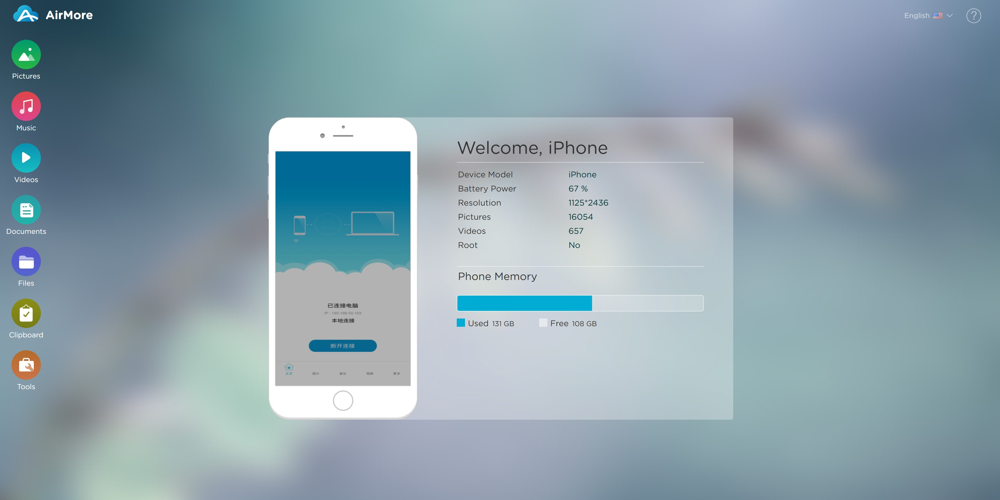
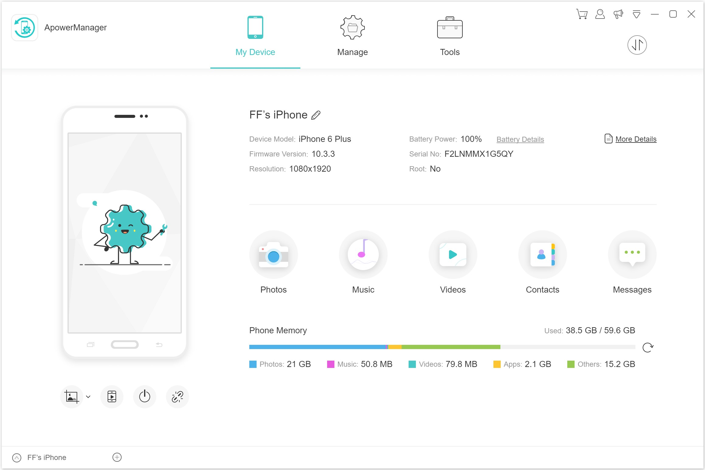
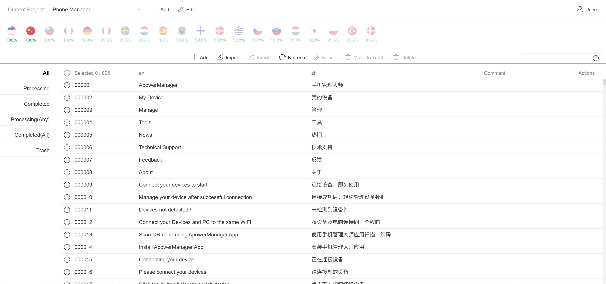
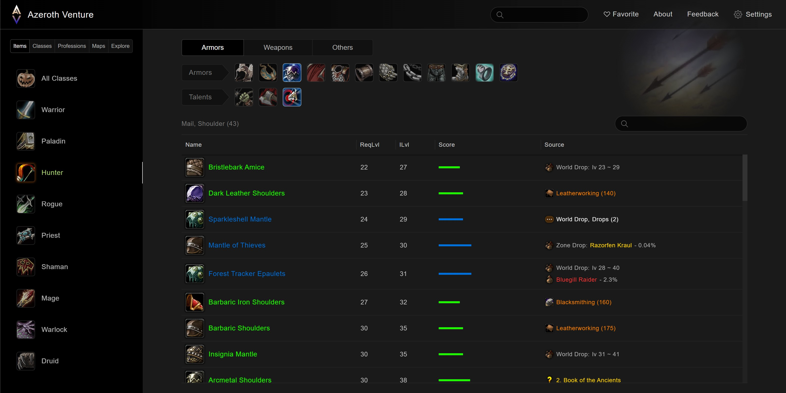
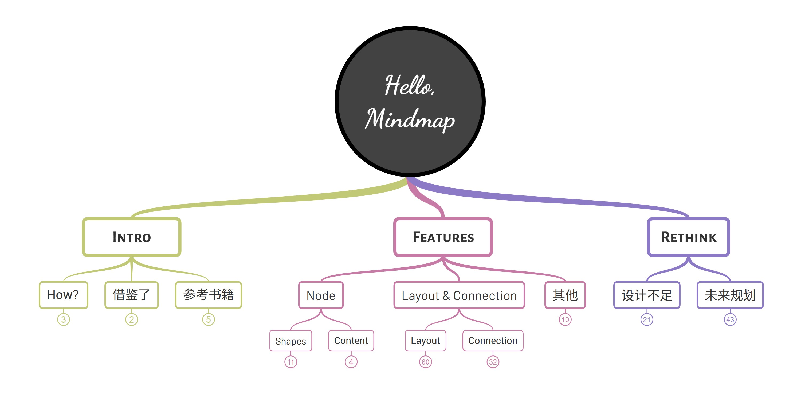

# About Me

## My skills & hobbies

- I have 15 years of experience in web development, and proficient in HTML, CSS, JavaScript, TypeScript, NodeJS, Electron.
- I'm skilled in Graphic Algorithms, and have rich experience building Graphic Apps.
- I have rich experience in building and refactoring UI systems.
- I enjoy collecting and categorizing data.

## Education and work career

- 2004~2008: WuHan University - Computer Sciences and Technology
- 2010~2011: Worked at a small company in ShenZhen, called <https://cfzx.cn/> (Not available any more), as frontend developer
- 2011~2015: Worked at MorningStar [Advisor WorkStation](https://workstation.morningstar.com/support/help-topics/blt9ac9152cd301abb7/blt717e87c790ee413a?lang=en-us) team, as frontend developer
- 2015~2018: Worked at [WangXuTech](https://www.wangxutech.com/), as frontend manager
- 2018~2019: Self-study on Design, Machine Learning
- 2019~2023: Worked at [WangXuTech](https://www.wangxutech.com/), as algorithm engineer
- 2023~2025: Think and design, working on some open-source projects like [lupos](https://github.com/pucelle/lupos)

## Betweens 2008 ~ 2010

After graduated and before first work.

- Played World of Warcraft much, made several plugins and model modifying tools for WoW.
- Created [WoW Professions](https://github.com/pucelle/wow-professions), [WoW Rare Finder / Atlasloot](https://github.com/pucelle/wow-rare-finder-atlasloot), they represented my feelings to WoW.

## Betweens 2010~2011

Worked at <https://cfzx.cn/> (Not available any more), daily work is building web pages by HTML and CSS, few JS.

## Betweens 2011~2015

Worked at MorningStar [Advisor WorkStation](https://workstation.morningstar.com/support/help-topics/blt9ac9152cd301abb7/blt717e87c790ee413a?lang=en-us) team, as a frontend developer.

My daily work is developing and maintaining an advisor system for investors. Here we use [Ext.js](https://www.sencha.com/products/extjs/) framework, it's an amazing framework, which totally affected my code style.

The culture and design style of MorningStar have greatly influenced on me.

## Betweens 2015~2018

Joined [WangXuTech](https://www.wangxutech.com/) to seek more challenges, as frontend leader.

### [web.airmore.com](http://web.airmore.com/)

It's a web tool that can manage phone resources.

Although still available, some features broken due to lack of maintenance, and some ugly ads added.

### Developed common ui library, and built sites by the library:

- [airmore.com](https://airmore.com/)
- [apowersoft.com](https://www.apowersoft.com/)
- [wantxutech.com](https://www.wangxutech.com/)
- [videograbber.net](https://videograbber.net/)
- ...

### [Apower Phone Manager](https://www.apowersoft.com/phone-manager)

A phone manager app, powered by Electron.

### Translation Management

It's an internal web app, I created it in my pocket of time to manage translations of Phone Manager, it saves much time for translators, so later it serves more projects.

## Betweens 2018~2019

A gap year, making a 'white-space' in mind, reading & learning, try to change from a task-doer to a thinker.

### [CSS Navigation](https://github.com/pucelle/vscode-css-navigation)

**CSS Navigation** is a VSCode plugin.

When I'm learning TypeScript and wanting to go deeper, and also found no good css plugin at that moment, so I created this plugin to practice my TypeScript skill.

It is 10x faster with only 1/10 memory usage and package size than it's competitors. Has 590K installs recently.

### [Azeroth Venture](https://wow.playjournals.com/classic/en/)

On 2019, when World of Warcraft Classic launched, I created this site, it's a single-page web application, I designed it from my own perspective, and it helped me exploring Azeroth well.

It provides much more convenient user experience for querying than other apps, and try to reach final query result directly.

### Others

- [flit.js](https://github.com/purhya/flit.js): A MVVM framework, obsoleted.
- [flit.ui](https://github.com/purhya/flit.ui): A UI library based on flit.js, serves [Azeroth Venture](https://wow.playjournals.com/classic/en/), obsoleted.
- [Run on Save](https://github.com/pucelle/vscode-run-on-save): A vscode plugin, just for convenience when compiling Sass codes.

## 2019~2023

Back to WangXuTech, start new career as an algorithm engineer.

### [OpenGL Effects](https://github.com/purhya/gl-effects-preview)

OpenGL effects, includes some OpenGL guides, preview of Color Adjustment and Transition effects. It serves some photo/video editing apps.

- [Color Adjustment](https://purhya.github.io/gl-effects-preview/#color-adjustment/)
- [Transitions](https://purhya.github.io/gl-effects-preview/#transitions/)

### [AEGL](https://purhya.github.io/gl-effects-preview/#aegl/)

**AEGL** aimed on rendering After Effects template with OpenGL, I created it for enhancing [LightMV](https://lightmv.com/).

This project had been abandoned because it encodes videos too slowly on browsers (20x slower than desktop apps).

Two years later, web codecs APIs becomes available, I replaced the video encoder and achieved 10x increasement in encoding speed. If aimed on implementing an independent app, not reply on AE to make template, this project is closer to reality.

### [Mindmap Core](https://github.com/purhya/mindmap-preview)

**Mindmap Core** is a mindmap library for [GitMind](https://gitmind.com/).

This library uses SVG to render just like other mindmap apps, but it improves performance much by bunching document reading and writing, so it reduces re-layout frequency. Otherwise, the library uses vector and direction modeling simplifies math computations.

### Others

- Matting Algorithm Implementation and Improvement: one of our team trains AI for removing image background, it generates alpha images for uploaded images. My task is researching papers, and implementing several in Python AOT / OpenGL, optimize parameters, compare and choose best.
- Other Image Enhancement Algorithm Design and Implementation: Like skin smoothing, tune enhancement...

## 2023 ~

### Reading & Researching.

Reading and Researching on Design Psychology, Information Flow Design.

### [lupos](https://github.com/pucelle/lupos)

**lupos** is a framework to support component-based programming in TypeScript.

In my web system programming career, I realized there are two problems can't be solved by experience or design:

- Observing data changes
- Efficiently update after data changes

**lupos** was designed to solve them.

### [lupos.js](https://github.com/pucelle/lupos.js)

**lupos.js** is a library for building Web User Interface, powered by **lupos**.

It's code is superior simple, it proves **lupos** can be used to build modern libraries like React.

### [flit](https://github.com/pucelle/flit)

**flit** is a lightweight Web UI system based on **lupos** and **lupos.js**.

**flit** was highly inspired by [MorningStar Design System](http://designsystem.morningstar.com/index.html).
