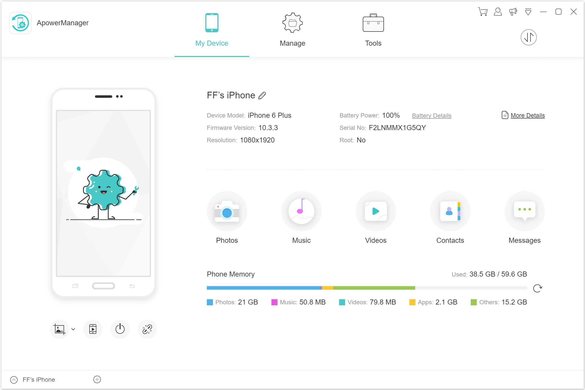
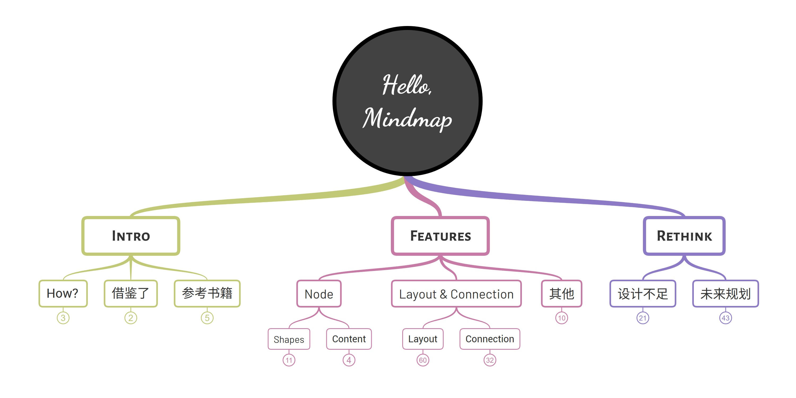

# 关于我

我是陈坤 (Freeman Chen)，来自深圳。

我的 Github: <https://github.com/pucelle>

我的职业生涯: <https://github.com/purhya/career>

## 技能 & 兴趣

- 拥有 15 年 Web 开发经验，掌握 HTML、CSS、JavaScript、TypeScript、NodeJS 和 Electron
- 掌握一般的图形与图像算法，并拥有丰富的图形类框架以及应用的开发经验
- 在构建和重构基础框架和运行库以及 UI 系统方面拥有丰富经验
- 喜欢收集和分类数据

## 教育背景与工作经历

- 2004~2008: 武汉大学 - 计算机科学与技术专业
- 2010~2011: 于深圳一家小公司 (https://cfzx.cn/，现已无法访问) 任前端开发
- 2011~2015: 于晨星资讯（MorningStar）[Advisor WorkStation](https://workstation.morningstar.com/support/help-topics/blt9ac9152cd301abb7/blt717e87c790ee413a?lang=en-us) 团队任前端开发工程师
- 2015~2018: 在网旭科技（WangXuTech）担任前端主管
- 2018~2019: 阅读并根据个人兴趣制作项目
- 2019~2023: 在网旭科技（WangXuTech）担任算法工程师
- 2024~2025: 学习设计，从事一些个人的开源项目，如 [lupos](https://github.com/pucelle/lupos)

## 2008 ~ 2010

大学毕业至第一份工作期间。

- 玩《魔兽世界》（World of Warcraft），为其制作了一些插件和模型修改工具。
- 创建了 [WoW Professions](https://github.com/pucelle/wow-professions) 和 [WoW Rare Finder / Atlasloot](https://github.com/pucelle/wow-rare-finder-atlasloot)，它们代表了我对 WoW 的感情。

## 2010~2011

- 就职于 <https://cfzx.cn/> (现已无法访问)，日常工作是通过 HTML 和 CSS 构建网页，涉及少量 JS。

## 2011~2015

在晨星资讯（MorningStar）[Advisor WorkStation](https://workstation.morningstar.com/support/help-topics/blt9ac9152cd301abb7/blt717e87c790ee413a?lang=en-us) 团队担任前端开发工程师。

我的日常工作是开发和维护一个面向投资者的顾问系统。日常使用 [Ext.js](https://www.sencha.com/products/extjs/) 框架，这是一个非常出色的框架，彻底影响了我的代码风格。

此外晨星资讯的企业文化和设计风格对我产生了深远的影响。

## 2015~2018

加入网旭科技（WangXuTech）以寻求更多挑战，担任前端负责人。

### [web.airmore.com](http://web.airmore.com/)

这是一个可以管理手机资源的 Web 工具。

虽然仍然可以访问，但由于缺乏维护，部分功能已失效，且有一些影响体验的广告存在。

### 开发通用 UI 库，并基于此构建网站：

- [airmore.com](https://airmore.com/)
- [apowersoft.com](https://www.apowersoft.com/)
- [wantxutech.com](https://www.wangxutech.com/)
- [videograbber.net](https://videograbber.net/)
- ...

### [Apower Phone Manager](https://www.apowersoft.com/phone-manager)

一款手机管理应用程序，基于 Electron 开发。

### 翻译管理系统

这是一个内部 Web 应用，我在碎片时间创建了它用来管理 Phone Manager 的翻译，它为翻译人员节省了大量时间，因此后来它服务了更多项目。

## 2018~2019

间隔年，从繁忙的工作中暂时脱离, 阅读与学习，尝试从一个任务执行者转变为一个思考者。

### [CSS Navigation](https://github.com/pucelle/vscode-css-navigation)

**CSS Navigation** 是一个 VSCode 插件。

当时我学习 TypeScript 并希望深入，同时发现此时没有好的 VSCode CSS 插件，因此我创建了这个插件来练习 TypeScript。

它提供更多的功能，比其竞争对手快 10 倍，且内存使用量和包大小仅为其 1/10。目前有 59 万安装。

### [Azeroth Venture](https://wow.playjournals.com/classic/en/)

2019 年魔兽世界经典怀旧服上线时，我创建了这个网站。它是一个单页 Web 应用，我完全基于我自己的视角设计了它，它也很好地帮助我探索了艾泽拉斯世界。

它提供了比其他应用程序方便得多的查询体验，并尝试直接呈现最终的查询结果。

### 其他

- [flit.js](https://github.com/purhya/flit.js): 一个 MVVM 框架，已过时。
- [flit.ui](https://github.com/purhya/flit.ui): 一个 UI 库，服务于 [Azeroth Venture](https://wow.playjournals.com/classic/en/)，已过时。
- [Run on Save](https://github.com/pucelle/vscode-run-on-save): 一个 VSCode 插件，只是为了方便编译 Sass 代码。

## 2019~2023

回到网旭科技（WangXuTech），开始新的职业生涯，担任算法工程师。

### OpenGL Effects

OpenGL 特效的演示，包含一些 OpenGL 指南、色彩调整和转场特效的预览。它为一些照片/视频编辑类应用提供服务。

- [颜色调整](https://purhya.github.io/gl-effects-preview/#color-adjustment/)
- [转场特效](https://purhya.github.io/gl-effects-preview/#transitions/)

### [AEGL](https://purhya.github.io/gl-effects-preview/#aegl/)

AEGL 旨在使用 OpenGL 渲染 After Effects 模板，我创建它是为了增强 [LightMV](https://lightmv.com/)。

该项目已被放弃，因为它在浏览器上编码视频速度太慢（比桌面应用程序慢 20 倍）。

两年后，Web Codecs API 可用，我更换了视频编码器，编码速度提升了 10 倍。

如果目标是实现一个独立的应用程序，而不依赖 AE 制作模板，那么这个项目会更加接近于现实。

### [Mindmap Core](https://github.com/purhya/mindmap-preview)

Mindmap Core 是为 [GitMind](https://gitmind.com/) 开发的思维导图核心库。

该库像其他思维导图应用一样使用 SVG 进行渲染，但通过批量处理文档元素的读取和写入的串行设计，减少了文档重新布局的频率，显著提高了性能。此外，该库使用矢量和方向建模大幅度简化了数学计算。

### 其他

抠图算法的实现与改进：团队训练用于去除图像背景的 AI，它会为上传的图像生成一个 Alpha 通道图。我的任务是合并原图和 Alpha 图形, 为此需要研究论文，并用 Python AOT / OpenGL 实现几种算法，优化参数，进行比较并选择最佳方案。

其他图像增强算法的设计与实现：如皮肤平滑、色调增强、绿幕抠图等。

## 2023 年至今

### 阅读与研究

阅读和研究设计心理学、信息流设计。

### [lupos](https://github.com/pucelle/lupos)

**lupos** 是一个基于 TypeScript 的用于组件编程的框架。

在我的 Web 系统编程生涯中，我意识到有两个问题无法通过经验或设计解决：

- 观察数据变化
- 数据变化后高效更新

**lupos** 旨在解决这两个问题。

### [lupos.js](https://github.com/pucelle/lupos.js)

**lupos.js** 是一个用于构建 Web 用户界面的库，由 **lupos** 驱动。

它的代码极其简洁，证明了 **lupos** 可用于构建像 React 这样的现代库。

### [flit](https://github.com/pucelle/flit)

**flit** 是一个基于 **lupos** 和 **lupos.js** 的轻量级 Web UI 库。

**flit** 深受 [MorningStar Design System](http://designsystem.morningstar.com/index.html) 的启发。